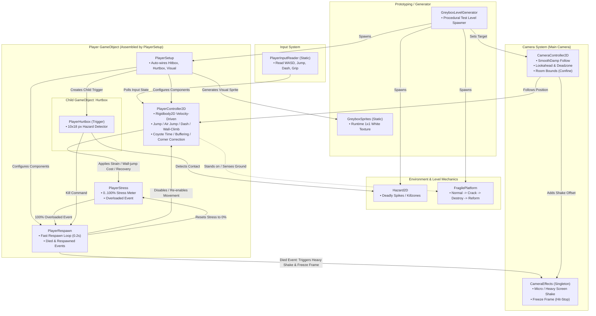
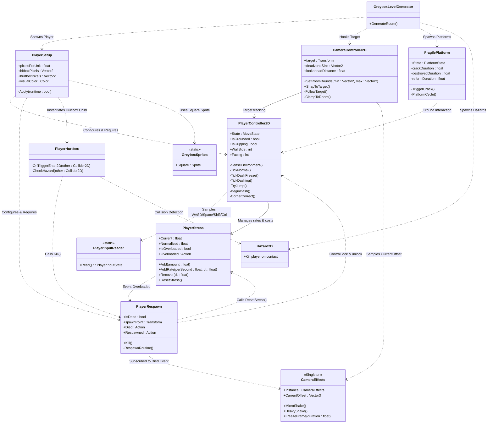

# Architecture Overview (Current Codebase)

ไฟล์นี้สรุปและแสดงโครงสร้างความสัมพันธ์ของคลาสทั้งหมดในโปรเจกต์ปัจจุบัน (`Assets/Scripts/`)

---

## 1. System Interaction & Data Flow (ภาพรวมการไหลของข้อมูลและอีเวนต์)

---

## 2. Class Diagram (ความสัมพันธ์เชิงคลาสและเมธอด)

